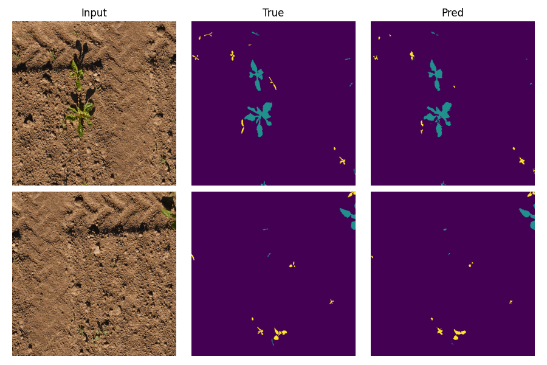
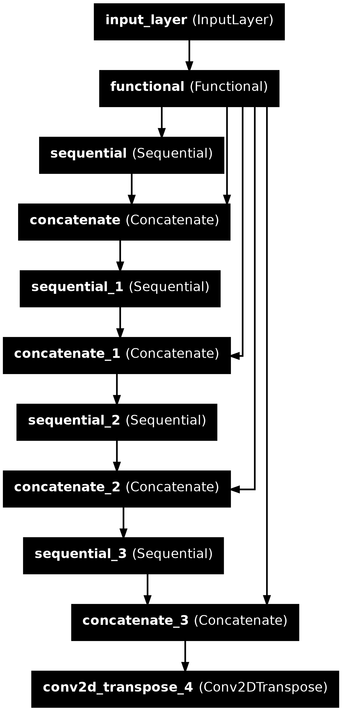
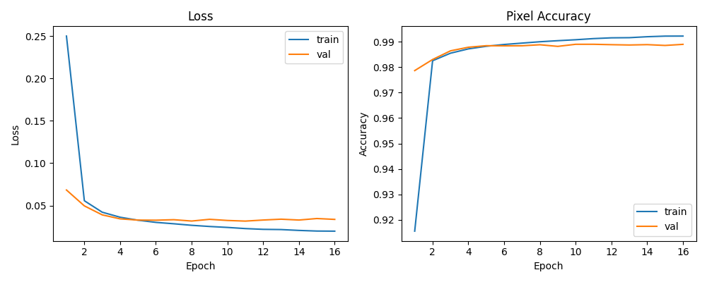

# PhenoBench Semantic Segmentation for plants and weeds.

## Overview
This project implements a TensorFlow U-Net for semantic leaf segmentation on [PhenoBench](https://www.phenobench.org/benchmarks.html) dataset
, following the PhenoBench [devkit data pipeline](https://github.com/PRBonn/phenobench/blob/main/phenobench_tutorial.ipynb) and general TensorFlow segmentation [tutorial](https://www.tensorflow.org/tutorials/images/segmentation). The tutorial uses a MobileNetV2 backbone, but as a novel contribution this project implements [MobileNetV3Small](https://arxiv.org/pdf/1905.02244) for a lightweight encoder with better [performance](https://arxiv.org/html/2505.03303v1), with U-Net skip connections and a decoder modeled after the [pix2pix](https://github.com/tensorflow/examples/blob/b5a8265e0b655001eaa859e7bd8ac9b4e03f3ce8/tensorflow_examples/models/pix2pix/pix2pix.py#L220C66-L220C71) upsampling blocks. Evaluation uses the PhenoBench devkit for metrics and early stopping to prevent overfitting.

The segmentation classes: `1 crop, 2 weed, 3 partial crop, 4 partial weeds`
## Architecture



The inputs to the UNet is normalised to `[-1,1]` to match MobileNetV3 pre-processing expectations. The backbone however is freezed during training for transfer learning. 

Since the model follows UNet architecture, skip connections are made at downsampling strides from the encoder to the decorder (tasked with upsampling). To find the correct layers, this article was [referenced](https://ieeexplore.ieee.org/document/9522652) (See figure below) but in the end using the keras `model.summary()` to identify the downsampling layers and matching them in the upsampling ladder (16→32→64→128→256) worked. 

  

In the model image above, the functional layer correspond to the back bone and each sequential layer correspond to an upsampling block. 

The upsampling blocks uses transposed convolution, batch-norm and then ReLu based on pix2pix suggested in the tutorial.

For multi-class semantic segmentation, the loss must compare per-pixel class probabilities against integer labels so the network learns to separate crop and weed pixels from soil/background thus categorical cross-entropy is used, specifically `SparseCategoricalCrossentropy(from_logits=True)` because the model outputs raw logits and the ground-truth masks store integer class ids.  However since there can be issues of class imbalance (dominant soil vs. smaller weed regions) biasing learning, potential future improvements include class weighting, focal loss, or resampling. However, for this project the above was used to keep it simple.

## Training Approach
The Adam optimizer is used with default hyperparameters with a batch size of 8 samples. Some light augmentation was done with horizontal flips to improve generalization without heavy compute overhead, leaving additional augmentation for future development.

An early stopping monitors the validation loss  and if it does not improve over 5 epochs, then training is stopped. Checkpoints save per-epoch weights for progress capture but also letting me choose the better weights after training and investigating the training vs validation loss graph.

Finally for validation, the PhenoBench devkit expects masks in a specific folder layout, so predictions are written to images and then the official evaluator is called to compute metrics.

## Validation Metrics (IoU)
For each class `c`, `IoU_c = |P_c ∩ G_c| / |P_c ∪ G_c| = TP_c / (TP_c + FP_c + FN_c)` where `P_c` are predicted pixels and `G_c` are ground-truth pixels. PhenoBench also uses mean IoU: `mIoU = (1/C) * Σ IoU_c` over the evaluated classes.

High soil IoU indicates the model segments background reliably; lower weed and plant IoU reflects the challenge of segmenting small, sparse, and heterogeneous regions accurately.
## Results
The training curves show training and validation loss decreasing overall. Training pixel accuracy decreases while validation pixel accuracy increases.




The validation can be done by supplying the checkpoint weights to the validation script:
- `python validate.py  --weights weights/2026_01_07_11_17/weights_epoch_010.weights.h5`
The final semantic metrics are:
```
  soil: 98.9
  crop: 90.45
  weed: 46.84
  mIoU: 78.73
```
Interestingly, the effect of augmentation and using a smaller training set can be seen (these results were taken during implementing the validation script):
```
Semantic metrics for no augmentation and 500 training samples:
  soil: 97.6
  crop: 76.06
  weed: 20.47
  mIoU: 64.71
```
This showcases the importance of augmentation and a large dataset.
This project's model performs worse when compared to the model implemented by the dataset authors where their metrics are:
```
 soil: 99.28
 crop: 94.30
 weed: 64.37
mIoU: 85.97

```
## Code Execution
The following serves as brief instruction to run this project locally.
1. Install dependencies: `pip install "numpy matplotlib tensorflow phenobench phenobench[eval]"
2. Download the PhenoBench [dataset](https://www.phenobench.org/dataset.html) 3. Copy dataset to project folder or change data directory in `load.py`
4. Adjust training parameters in `train.py` if needed and then run `python train.py`.
5. After training, use checkpoint weights `python validate.py  --weights weights/2026_01_07_11_17/weights_epoch_010.weights.h5` and check results.

## Future Work
- Altough this project implements cross-entropy, another approach could be to add class weights or focal loss to counter soil dominance and improve weed recall without hurting crop precision.
- Since the results above showed how augmentation improves results, expanding augmentation (color jitter, small rotations, scale jitter, CutMix/MixUp for masks) and consider oversampling weed-heavy images could improve performance.
- Lastly, further training improvements could be to unfreeze the backbone in later stages for fine-tuning. This could improve the model's ability to generalize better over the PhenoBench dataset. 

## Sources
- PhenoBench benchmark: https://www.phenobench.org/benchmarks.html
- PhenoBench tutorial notebook: https://github.com/PRBonn/phenobench/blob/main/phenobench_tutorial.ipynb
- Segmentation overview: https://arxiv.org/pdf/1910.07655
- TensorFlow segmentation tutorial (MobileNet U-Net): https://www.tensorflow.org/tutorials/images/segmentation
- MobileNetV3 balance discussion: https://arxiv.org/html/2505.03303v1
- Pix2pix upsample block: https://github.com/tensorflow/examples/blob/b5a8265e0b655001eaa859e7bd8ac9b4e03f3ce8/tensorflow_examples/models/pix2pix/pix2pix.py#L220C66-L220C71
- MobileNetV3 reference: https://ieeexplore.ieee.org/document/9522652
- MobileNetV3 original paper: https://arxiv.org/pdf/1905.02244
- Early stopping overview: https://cyborgcodes.medium.com/what-is-early-stopping-in-deep-learning-eeb1e710a3cf
